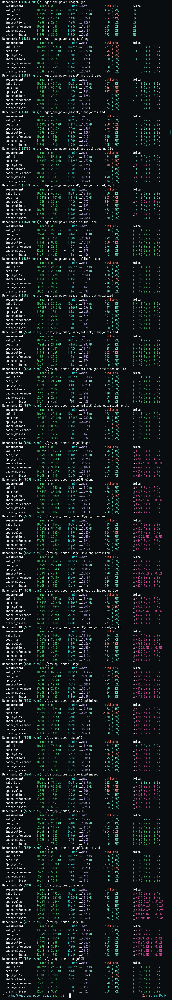

# Simple CPU Power Consumption Script Gone Wild
This repository contains a performance competition among different languages to provide the fastest binary for a CPU power consumption script. I benchmarked the binaries using [poop](https://github.com/andrewrk/poop) by running each benchmark for 60 seconds:

```sh
poop -d 60000
```

`I'm not a master of any of the languages, so I relied on the help of AI for languages like Go, Rust, and ASM.`

### Compiling
I compiled the binaries using both the default compiler settings and with various optimizations.

- **C & C++**
  - Compiler versions:
  ```
  gcc (Gentoo 14.2.1_p20241221 p7) 14.2.1 20241221
  clang version 19.1.7
  ```
  - default:
  ```
  gcc get_cpu_power_usage.c -o get_cpu_power_usageC
  clang get_cpu_power_usage.c -o get_cpu_power_usageC
  g++ get_cpu_power_usage.cpp -o get_cpu_power_usageCPP
  c++ get_cpu_power_usage.cpp -o get_cpu_power_usageCPP
  ```
  - optimizations:
  ```
  gcc -O3 -march=native -flto get_cpu_power_usage.c -o get_cpu_power_usageC_optimized
  clang -O3 -march=native -flto get_cpu_power_usage.c -o get_cpu_power_usageC_optimized
  g++ -O3 -march=native -flto get_cpu_power_usage.cpp -o get_cpu_power_usageCPP_optimized
  c++ -O3 -march=native -flto get_cpu_power_usage.cpp -o get_cpu_power_usageCPP_optimized
  ```
  - nolibc:
  ```
  gcc -nostdlib -static get_cpu_power_usageC_nolibc -o get_cpu_power_usage_nolibcC
  clang -nostdlib -static -fno-stack-protector get_cpu_power_usageC_nolibc -o get_cpu_power_usage_nolibcC
  gcc -nostdlib -static -O3 -march=native -flto get_cpu_power_usage.c -o get_cpu_power_usage_nolibcC_optimized
  clang -nostdlib -static -fno-stack-protector -ffast-math -march=native -flto get_cpu_power_usage.c -o get_cpu_power_usage_nolibcC_optimized
  ```
  `nolibc compiled with clang segfaulted with any -O flags`

- **GO**
  - Compiler versions:
  ```
  go version go1.23.6 linux/amd64
  ```
  - default:
  ```
  go build -o get_cpu_power_usageGO ./get_cpu_power_usage.go
  ```
  - optimizations:
  ```
  go build -ldflags="-s -w" -trimpath -o get_cpu_power_usageGO_optimized ./get_cpu_power_usage.go
  ```
  `This did not provide good results.`

- **Rust**
  - Compiler versions:
  ```
  rustc 1.84.1 (e71f9a9a9 2025-01-27)
  ```
  - default:
  ```
  rustc get_cpu_power_usage.rs -o get_cpu_power_usageRS
  ```
  - optimizations:
  ```
  rustc -C opt-level=3 -C lto=thin -C target-cpu=native -C codegen-units=1 -C panic=abort get_cpu_power_usage.rs -o get_cpu_power_usageRS_optimized
  ```

- **Zig**
  - Compiler versions:
  ```
  0.14.0-dev.2567+497592c9b
  ```
  - default:
  ```
  zig build-exe get_cpu_power_usage.zig --name get_cpu_power_usageZIG
  ```
  - optimizations:
  ```
  zig build-exe -O ReleaseFast get_cpu_power_usage.zig --name get_cpu_power_usageZIG_optimized
  ```

- **ASM**
  ```
  nasm -f elf64 get_cpu_power_usage.asm -o get_cpu_power_usage.o
  ld -o get_cpu_power_usageASM get_cpu_power_usage.o
  ```


---


<details>
<summary>Text version of benchmarks</summary>

```code
Benchmark 1 (5808 runs): ./get_cpu_power_usageC_gcc
  measurement          mean ± σ            min … max           outliers         delta
  wall_time          10.3ms ± 48.0us    10.2ms … 10.5ms        426 ( 7%)        0%
  peak_rss           1.63MB ± 99.2KB    1.12MB … 1.73MB        962 (17%)        0%
  cpu_cycles          164K  ± 17.1K      148K  …  324K         834 (14%)        0%
  instructions        128K  ± 22.3       128K  …  128K           0 ( 0%)        0%
  cache_references   10.6K  ±  335      9.98K  … 13.0K         333 ( 6%)        0%
  cache_misses       4.43K  ±  258      3.30K  … 6.18K         359 ( 6%)        0%
  branch_misses      2.39K  ± 39.0      2.08K  … 2.68K         173 ( 3%)        0%
Benchmark 2 (5813 runs): ./get_cpu_power_usageC_clang
  measurement          mean ± σ            min … max           outliers         delta
  wall_time          10.3ms ± 45.8us    10.2ms … 10.7ms        707 (12%)          -  0.1% ±  0.0%
  peak_rss           1.63MB ± 99.1KB    1.11MB … 1.72MB        945 (16%)          +  0.1% ±  0.2%
  cpu_cycles          164K  ± 18.0K      150K  …  357K         798 (14%)          -  0.3% ±  0.4%
  instructions        128K  ± 22.6       128K  …  128K           0 ( 0%)          +  0.0% ±  0.0%
  cache_references   10.6K  ±  313      9.96K  … 13.5K         361 ( 6%)          -  0.7% ±  0.1%
  cache_misses       4.41K  ±  245      3.46K  … 6.49K         330 ( 6%)          -  0.4% ±  0.2%
  branch_misses      2.38K  ± 40.7      1.97K  … 2.58K         185 ( 3%)          -  0.4% ±  0.1%
Benchmark 3 (5813 runs): ./get_cpu_power_usageC_gcc_optimized
  measurement          mean ± σ            min … max           outliers         delta
  wall_time          10.3ms ± 46.7us    10.2ms … 10.8ms        457 ( 8%)          -  0.0% ±  0.0%
  peak_rss           1.63MB ± 99.7KB    1.09MB … 1.72MB        966 (17%)          +  0.0% ±  0.2%
  cpu_cycles          164K  ± 15.9K      147K  …  349K         837 (14%)          -  0.5% ±  0.4%
  instructions        128K  ± 22.7       128K  …  128K           1 ( 0%)          +  0.2% ±  0.0%
  cache_references   10.5K  ±  322      9.90K  … 12.7K         344 ( 6%)        ⚡-  1.2% ±  0.1%
  cache_misses       4.40K  ±  253      3.44K  … 6.31K         385 ( 7%)          -  0.5% ±  0.2%
  branch_misses      2.39K  ± 40.8      1.93K  … 2.55K         174 ( 3%)          -  0.2% ±  0.1%
Benchmark 4 (5811 runs): ./get_cpu_power_usageC_clang_optimized
  measurement          mean ± σ            min … max           outliers         delta
  wall_time          10.3ms ± 47.3us    10.2ms … 10.6ms        369 ( 6%)          -  0.0% ±  0.0%
  peak_rss           1.63MB ± 99.1KB    1.11MB … 1.73MB        950 (16%)          +  0.1% ±  0.2%
  cpu_cycles          165K  ± 17.3K      146K  …  336K         776 (13%)          +  0.2% ±  0.4%
  instructions        129K  ± 23.4       129K  …  129K           7 ( 0%)          +  0.5% ±  0.0%
  cache_references   10.6K  ±  336      9.82K  … 15.0K         310 ( 5%)          -  0.4% ±  0.1%
  cache_misses       4.42K  ±  259      3.20K  … 6.31K         341 ( 6%)          -  0.1% ±  0.2%
  branch_misses      2.39K  ± 43.0      1.94K  … 2.60K         195 ( 3%)          +  0.0% ±  0.1%
Benchmark 5 (5798 runs): ./get_cpu_power_usageC_gcc_optimized_no_lto
  measurement          mean ± σ            min … max           outliers         delta
  wall_time          10.3ms ± 56.8us    10.2ms … 11.0ms         64 ( 1%)          +  0.2% ±  0.0%
  peak_rss           1.63MB ± 99.0KB    1.12MB … 1.72MB        964 (17%)          +  0.1% ±  0.2%
  cpu_cycles          169K  ± 28.8K      146K  …  374K         910 (16%)        💩+  2.7% ±  0.5%
  instructions        128K  ± 29.9       128K  …  129K          67 ( 1%)          +  0.1% ±  0.0%
  cache_references   10.6K  ±  357      9.80K  … 13.5K         387 ( 7%)          +  0.0% ±  0.1%
  cache_misses       4.49K  ±  281      3.25K  … 6.39K         440 ( 8%)        💩+  1.3% ±  0.2%
  branch_misses      2.39K  ± 40.2      2.01K  … 2.62K         176 ( 3%)          +  0.0% ±  0.1%
Benchmark 6 (5789 runs): ./get_cpu_power_usageC_clang_optimized_no_lto
  measurement          mean ± σ            min … max           outliers         delta
  wall_time          10.3ms ± 63.6us    10.3ms … 10.8ms         60 ( 1%)          +  0.3% ±  0.0%
  peak_rss           1.63MB ±  101KB    1.11MB … 1.72MB       1003 (17%)          -  0.1% ±  0.2%
  cpu_cycles          173K  ± 37.6K      148K  …  573K         844 (15%)        💩+  5.3% ±  0.6%
  instructions        129K  ± 25.0       129K  …  129K          21 ( 0%)          +  0.4% ±  0.0%
  cache_references   10.7K  ±  450      9.30K  … 13.4K         402 ( 7%)          +  0.6% ±  0.1%
  cache_misses       4.53K  ±  307      3.78K  … 6.39K         251 ( 4%)        💩+  2.2% ±  0.2%
  branch_misses      2.39K  ± 39.4      1.98K  … 2.55K         130 ( 2%)          -  0.2% ±  0.1%
Benchmark 7 (5870 runs): ./get_cpu_power_usage_nolibcC_gcc
  measurement          mean ± σ            min … max           outliers         delta
  wall_time          10.2ms ± 22.1us    10.1ms … 10.4ms        160 ( 3%)        ⚡-  1.0% ±  0.0%
  peak_rss            924KB ± 21.7KB     614KB …  987KB         37 ( 1%)        ⚡- 43.4% ±  0.2%
  cpu_cycles         2.09K  ±  659      1.30K  … 9.82K         449 ( 8%)        ⚡- 98.7% ±  0.3%
  instructions       1.16K  ± 0.32      1.16K  … 1.16K         660 (11%)        ⚡- 99.1% ±  0.0%
  cache_references    118   ± 29.8        67   …  387          276 ( 5%)        ⚡- 98.9% ±  0.1%
  cache_misses       22.5   ± 17.3         0   …  179          265 ( 5%)        ⚡- 99.5% ±  0.1%
  branch_misses      21.9   ± 4.53        16   …   36            2 ( 0%)        ⚡- 99.1% ±  0.0%
Benchmark 8 (5869 runs): ./get_cpu_power_usage_nolibcC_clang
  measurement          mean ± σ            min … max           outliers         delta
  wall_time          10.2ms ± 24.9us    10.1ms … 10.6ms        141 ( 2%)        ⚡-  1.0% ±  0.0%
  peak_rss            924KB ± 20.5KB     614KB …  926KB         35 ( 1%)        ⚡- 43.3% ±  0.2%
  cpu_cycles         2.19K  ±  735      1.37K  … 9.54K         420 ( 7%)        ⚡- 98.7% ±  0.3%
  instructions       1.15K  ± 3.35      1.15K  … 1.18K         725 (12%)        ⚡- 99.1% ±  0.0%
  cache_references    139   ± 32.4        83   …  321          218 ( 4%)        ⚡- 98.7% ±  0.1%
  cache_misses       28.2   ± 21.4         0   …  143          115 ( 2%)        ⚡- 99.4% ±  0.1%
  branch_misses      20.2   ± 4.42        16   …   35           10 ( 0%)        ⚡- 99.2% ±  0.0%
Benchmark 9 (5871 runs): ./get_cpu_power_usage_nolibcC_gcc_optimized
  measurement          mean ± σ            min … max           outliers         delta
  wall_time          10.2ms ± 25.8us    10.1ms … 10.4ms        163 ( 3%)        ⚡-  1.1% ±  0.0%
  peak_rss            923KB ± 26.8KB     610KB …  926KB         57 ( 1%)        ⚡- 43.4% ±  0.2%
  cpu_cycles         1.33K  ±  531       818   … 6.85K         460 ( 8%)        ⚡- 99.2% ±  0.3%
  instructions        490   ± 2.62       490   …  514          391 ( 7%)        ⚡- 99.6% ±  0.0%
  cache_references    137   ± 27.8        49   …  245           41 ( 1%)        ⚡- 98.7% ±  0.1%
  cache_misses       22.7   ± 20.0         0   …  139          187 ( 3%)        ⚡- 99.5% ±  0.1%
  branch_misses      15.3   ± 5.03        10   …   28            0 ( 0%)        ⚡- 99.4% ±  0.0%
Benchmark 10 (5868 runs): ./get_cpu_power_usage_nolibcC_clang_optimized
  measurement          mean ± σ            min … max           outliers         delta
  wall_time          10.2ms ± 23.4us    10.1ms … 10.4ms        117 ( 2%)          -  1.0% ±  0.0%
  peak_rss            924KB ± 21.0KB     614KB …  987KB         36 ( 1%)        ⚡- 43.3% ±  0.2%
  cpu_cycles         2.31K  ±  781      1.42K  … 11.1K         448 ( 8%)        ⚡- 98.6% ±  0.3%
  instructions       1.11K  ± 1.69      1.11K  … 1.15K         652 (11%)        ⚡- 99.1% ±  0.0%
  cache_references    132   ± 31.8        76   …  353          212 ( 4%)        ⚡- 98.8% ±  0.1%
  cache_misses       26.7   ± 19.8         0   …  174          123 ( 2%)        ⚡- 99.4% ±  0.1%
  branch_misses      22.7   ± 3.14        16   …   31            0 ( 0%)        ⚡- 99.1% ±  0.0%
Benchmark 11 (5866 runs): ./get_cpu_power_usage_nolibcC_gcc_optimized_no_lto
  measurement          mean ± σ            min … max           outliers         delta
  wall_time          10.2ms ± 25.5us    10.1ms … 10.4ms        104 ( 2%)          -  1.0% ±  0.0%
  peak_rss            924KB ± 24.2KB     614KB …  987KB         50 ( 1%)        ⚡- 43.4% ±  0.2%
  cpu_cycles         1.52K  ±  598       848   … 6.23K         489 ( 8%)        ⚡- 99.1% ±  0.3%
  instructions        490   ± 2.04       490   …  514          353 ( 6%)        ⚡- 99.6% ±  0.0%
  cache_references    142   ± 24.9        63   …  258          110 ( 2%)        ⚡- 98.7% ±  0.1%
  cache_misses       32.7   ± 20.6         0   …  119           39 ( 1%)        ⚡- 99.3% ±  0.1%
  branch_misses      17.7   ± 4.67        10   …   28            0 ( 0%)        ⚡- 99.3% ±  0.0%
Benchmark 12 (5874 runs): ./get_cpu_power_usage_nolibcC_clang_optimized_no_lto
  measurement          mean ± σ            min … max           outliers         delta
  wall_time          10.2ms ± 20.8us    10.1ms … 10.5ms        122 ( 2%)        ⚡-  1.1% ±  0.0%
  peak_rss            924KB ± 22.0KB     504KB …  987KB         45 ( 1%)        ⚡- 43.4% ±  0.2%
  cpu_cycles         2.06K  ±  525      1.43K  … 8.34K         284 ( 5%)        ⚡- 98.7% ±  0.3%
  instructions       1.15K  ± 0.33      1.15K  … 1.15K         724 (12%)        ⚡- 99.1% ±  0.0%
  cache_references    137   ± 28.1        84   …  316          268 ( 5%)        ⚡- 98.7% ±  0.1%
  cache_misses       24.3   ± 17.4         0   …  141          269 ( 5%)        ⚡- 99.5% ±  0.1%
  branch_misses      19.5   ± 3.83        16   …   34          436 ( 7%)        ⚡- 99.2% ±  0.0%
Benchmark 13 (5603 runs): ./get_cpu_power_usageCPP_gcc
  measurement          mean ± σ            min … max           outliers         delta
  wall_time          10.7ms ±  143us    10.5ms … 12.4ms         48 ( 1%)        💩+  3.7% ±  0.0%
  peak_rss           3.64MB ± 89.8KB    3.10MB … 3.91MB        452 ( 8%)        💩+123.3% ±  0.2%
  cpu_cycles         1.32M  ±  258K     1.17M  … 2.76M        1054 (19%)        💩+705.1% ±  4.0%
  instructions       2.53M  ± 23.3      2.53M  … 2.53M           9 ( 0%)        💩+1877.6% ±  0.0%
  cache_references   57.7K  ± 3.39K     44.5K  …  104K         288 ( 5%)        💩+442.5% ±  0.8%
  cache_misses       14.1K  ± 1.51K     11.8K  … 21.8K         363 ( 6%)        💩+219.5% ±  0.9%
  branch_misses      14.0K  ±  110      12.8K  … 14.6K         251 ( 4%)        💩+487.1% ±  0.1%
Benchmark 14 (5595 runs): ./get_cpu_power_usageCPP_clang
  measurement          mean ± σ            min … max           outliers         delta
  wall_time          10.7ms ±  150us    10.5ms … 11.3ms         18 ( 0%)        💩+  3.8% ±  0.0%
  peak_rss           3.65MB ± 86.0KB    3.14MB … 3.94MB        406 ( 7%)        💩+123.4% ±  0.2%
  cpu_cycles         1.35M  ±  300K     1.17M  … 3.10M        1097 (20%)        💩+723.2% ±  4.7%
  instructions       2.53M  ± 23.0      2.53M  … 2.53M           5 ( 0%)        💩+1877.6% ±  0.0%
  cache_references   57.8K  ± 3.69K     54.2K  …  141K         399 ( 7%)        💩+442.8% ±  0.9%
  cache_misses       14.2K  ± 1.36K     12.0K  … 21.8K         345 ( 6%)        💩+221.1% ±  0.8%
  branch_misses      14.0K  ±  104      13.3K  … 14.7K         208 ( 4%)        💩+487.4% ±  0.1%
Benchmark 15 (5576 runs): ./get_cpu_power_usageCPP_gcc_optimized
  measurement          mean ± σ            min … max           outliers         delta
  wall_time          10.7ms ±  164us    10.5ms … 12.1ms         13 ( 0%)        💩+  4.2% ±  0.0%
  peak_rss           3.64MB ± 94.1KB    3.07MB … 3.93MB        498 ( 9%)        💩+123.1% ±  0.2%
  cpu_cycles         1.43M  ±  348K     1.19M  … 3.33M        1054 (19%)        💩+772.4% ±  5.4%
  instructions       2.55M  ± 39.7      2.55M  … 2.55M         179 ( 3%)        💩+1893.0% ±  0.0%
  cache_references   57.7K  ± 3.39K     46.5K  …  121K         223 ( 4%)        💩+442.5% ±  0.8%
  cache_misses       14.2K  ± 1.53K     11.6K  … 20.7K         352 ( 6%)        💩+220.6% ±  0.9%
  branch_misses      14.6K  ±  112      14.2K  … 15.2K         273 ( 5%)        💩+512.6% ±  0.1%
Benchmark 16 (5569 runs): ./get_cpu_power_usageCPP_clang_optimized
  measurement          mean ± σ            min … max           outliers         delta
  wall_time          10.8ms ±  162us    10.5ms … 11.9ms         10 ( 0%)        💩+  4.3% ±  0.0%
  peak_rss           3.64MB ± 92.4KB    3.01MB … 3.90MB        474 ( 9%)        💩+122.9% ±  0.2%
  cpu_cycles         1.43M  ±  348K     1.16M  … 3.05M         452 ( 8%)        💩+768.6% ±  5.4%
  instructions       2.53M  ± 40.8      2.53M  … 2.53M         190 ( 3%)        💩+1875.0% ±  0.0%
  cache_references   57.4K  ± 3.10K     45.6K  … 95.0K         217 ( 4%)        💩+439.8% ±  0.8%
  cache_misses       14.3K  ± 1.53K     11.4K  … 22.2K         349 ( 6%)        💩+223.3% ±  0.9%
  branch_misses      14.0K  ±  108      13.1K  … 14.6K         234 ( 4%)        💩+484.9% ±  0.1%
Benchmark 17 (5590 runs): ./get_cpu_power_usageCPP_gcc_optimized_no_lto
  measurement          mean ± σ            min … max           outliers         delta
  wall_time          10.7ms ±  157us    10.5ms … 11.4ms         11 ( 0%)        💩+  3.9% ±  0.0%
  peak_rss           3.64MB ± 89.4KB    3.10MB … 3.91MB        428 ( 8%)        💩+123.4% ±  0.2%
  cpu_cycles         1.38M  ±  309K     1.19M  … 2.97M        1150 (21%)        💩+739.2% ±  4.8%
  instructions       2.55M  ± 26.3      2.55M  … 2.55M          39 ( 1%)        💩+1892.9% ±  0.0%
  cache_references   57.2K  ± 2.78K     46.2K  …  107K         367 ( 7%)        💩+437.3% ±  0.7%
  cache_misses       13.9K  ± 1.42K     11.8K  … 22.5K         375 ( 7%)        💩+214.9% ±  0.8%
  branch_misses      14.6K  ±  110      13.8K  … 15.2K         271 ( 5%)        💩+511.5% ±  0.1%
Benchmark 18 (5579 runs): ./get_cpu_power_usageCPP_clang_optimized_no_lto
  measurement          mean ± σ            min … max           outliers         delta
  wall_time          10.7ms ±  160us    10.5ms … 11.9ms         16 ( 0%)        💩+  4.1% ±  0.0%
  peak_rss           3.65MB ± 85.6KB    3.17MB … 3.94MB        373 ( 7%)        💩+123.6% ±  0.2%
  cpu_cycles         1.42M  ±  328K     1.19M  … 3.26M        1016 (18%)        💩+761.2% ±  5.1%
  instructions       2.55M  ± 42.0      2.55M  … 2.55M         191 ( 3%)        💩+1892.9% ±  0.0%
  cache_references   57.4K  ± 2.99K     49.2K  …  112K         281 ( 5%)        💩+439.0% ±  0.7%
  cache_misses       14.0K  ± 1.37K     11.9K  … 21.2K         362 ( 6%)        💩+216.3% ±  0.8%
  branch_misses      14.6K  ±  106      13.7K  … 15.2K         244 ( 4%)        💩+511.7% ±  0.1%
Benchmark 19 (5585 runs): ./get_cpu_power_usageGO
  measurement          mean ± σ            min … max           outliers         delta
  wall_time          10.7ms ± 87.3us    10.5ms … 11.4ms         59 ( 1%)        💩+  4.0% ±  0.0%
  peak_rss           3.70MB ±  245KB    2.98MB … 5.91MB       1889 (34%)        💩+126.8% ±  0.4%
  cpu_cycles          488K  ± 77.0K      337K  …  884K         242 ( 4%)        💩+196.6% ±  1.2%
  instructions        539K  ± 12.0K      501K  …  606K         171 ( 3%)        💩+320.5% ±  0.2%
  cache_references   43.9K  ± 2.83K     35.8K  … 56.7K          30 ( 1%)        💩+312.7% ±  0.7%
  cache_misses       14.8K  ± 1.85K     9.59K  … 23.6K          34 ( 1%)        💩+233.6% ±  1.1%
  branch_misses      4.12K  ±  448      2.96K  … 5.39K           0 ( 0%)        💩+ 72.5% ±  0.5%
Benchmark 20 (5583 runs): ./get_cpu_power_usageGO_optimized
  measurement          mean ± σ            min … max           outliers         delta
  wall_time          10.7ms ±  124us    10.5ms … 17.5ms         53 ( 1%)        💩+  4.1% ±  0.0%
  peak_rss           3.69MB ±  237KB    2.98MB … 5.91MB       2016 (36%)        💩+126.4% ±  0.4%
  cpu_cycles          498K  ± 75.6K      350K  … 1.18M         280 ( 5%)        💩+202.6% ±  1.2%
  instructions        539K  ± 11.6K      499K  …  610K         169 ( 3%)        💩+320.5% ±  0.2%
  cache_references   44.3K  ± 2.80K     36.9K  … 55.4K          23 ( 0%)        💩+316.4% ±  0.7%
  cache_misses       14.9K  ± 1.85K     9.98K  … 22.8K          23 ( 0%)        💩+236.2% ±  1.1%
  branch_misses      4.11K  ±  439      3.05K  … 5.47K           0 ( 0%)        💩+ 72.1% ±  0.5%
Benchmark 21 (5755 runs): ./get_cpu_power_usageRS
  measurement          mean ± σ            min … max           outliers         delta
  wall_time          10.4ms ± 76.9us    10.3ms … 11.4ms         64 ( 1%)          +  0.9% ±  0.0%
  peak_rss           2.05MB ± 77.6KB    1.46MB … 2.25MB        476 ( 8%)        💩+ 25.8% ±  0.2%
  cpu_cycles          281K  ± 46.8K      251K  …  653K         808 (14%)        💩+ 70.8% ±  0.8%
  instructions        306K  ±  337       305K  …  308K          45 ( 1%)        💩+138.5% ±  0.0%
  cache_references   18.1K  ±  638      16.8K  … 22.5K         430 ( 7%)        💩+ 70.0% ±  0.2%
  cache_misses       6.79K  ±  501      5.52K  … 9.46K         216 ( 4%)        💩+ 53.4% ±  0.3%
  branch_misses      3.81K  ± 53.0      3.21K  … 4.06K         205 ( 4%)        💩+ 59.4% ±  0.1%
Benchmark 22 (5765 runs): ./get_cpu_power_usageRS_optimized
  measurement          mean ± σ            min … max           outliers         delta
  wall_time          10.4ms ± 71.7us    10.3ms … 10.9ms        232 ( 4%)          +  0.8% ±  0.0%
  peak_rss           2.02MB ± 99.0KB    1.44MB … 2.15MB        795 (14%)        💩+ 23.6% ±  0.2%
  cpu_cycles          269K  ± 41.8K      242K  …  706K         940 (16%)        💩+ 63.6% ±  0.7%
  instructions        297K  ±  334       296K  …  299K          29 ( 1%)        💩+131.5% ±  0.0%
  cache_references   17.3K  ±  634      14.8K  … 21.3K         481 ( 8%)        💩+ 62.4% ±  0.2%
  cache_misses       6.42K  ±  441      5.74K  … 9.03K         348 ( 6%)        💩+ 45.0% ±  0.3%
  branch_misses      3.68K  ± 50.3      3.02K  … 3.97K         163 ( 3%)        💩+ 53.9% ±  0.1%
Benchmark 23 (5822 runs): ./get_cpu_power_usageZIG
  measurement          mean ± σ            min … max           outliers         delta
  wall_time          10.3ms ± 47.9us    10.2ms … 12.2ms        127 ( 2%)          -  0.2% ±  0.0%
  peak_rss            923KB ± 23.2KB     610KB … 1.00MB         79 ( 1%)        ⚡- 43.4% ±  0.2%
  cpu_cycles         52.5K  ± 11.4K     34.9K  …  113K         162 ( 3%)        ⚡- 68.1% ±  0.3%
  instructions       24.5K  ±  168      24.1K  … 24.7K        1904 (33%)        ⚡- 80.9% ±  0.0%
  cache_references   3.99K  ±  383      2.76K  … 5.64K           8 ( 0%)        ⚡- 62.5% ±  0.1%
  cache_misses       1.52K  ±  303       345   … 2.85K           4 ( 0%)        ⚡- 65.8% ±  0.2%
  branch_misses       341   ± 78.2       149   …  511            0 ( 0%)        ⚡- 85.7% ±  0.1%
Benchmark 24 (5854 runs): ./get_cpu_power_usageZIG_optimized
  measurement          mean ± σ            min … max           outliers         delta
  wall_time          10.2ms ± 28.1us    10.1ms … 10.8ms        168 ( 3%)          -  0.8% ±  0.0%
  peak_rss            923KB ± 29.3KB     549KB …  926KB         68 ( 1%)        ⚡- 43.4% ±  0.2%
  cpu_cycles         6.94K  ± 1.38K     4.76K  … 16.6K         203 ( 3%)        ⚡- 95.8% ±  0.3%
  instructions       2.56K  ±  118      2.32K  … 2.75K        1877 (32%)        ⚡- 98.0% ±  0.0%
  cache_references    527   ± 53.8       317   …  764           59 ( 1%)        ⚡- 95.1% ±  0.1%
  cache_misses        221   ± 68.8        48   …  416            0 ( 0%)        ⚡- 95.0% ±  0.2%
  branch_misses      86.1   ± 16.0        40   …  112            0 ( 0%)        ⚡- 96.4% ±  0.0%
Benchmark 25 (3698 runs): ./get_cpu_power_usage.py
  measurement          mean ± σ            min … max           outliers         delta
  wall_time          16.2ms ±  492us    15.1ms … 18.5ms         11 ( 0%)        💩+ 56.6% ±  0.1%
  peak_rss           11.0MB ±  247KB    9.62MB … 11.5MB        122 ( 3%)        💩+574.2% ±  0.4%
  cpu_cycles         24.4M  ± 1.44M     22.1M  … 29.9M           4 ( 0%)        💩+13910.8% ± 21.2%
  instructions       39.2M  ± 38.8K     39.1M  … 39.4M          33 ( 1%)        💩+30524.3% ±  0.8%
  cache_references   1.96M  ± 28.8K     1.90M  … 2.15M          65 ( 2%)        💩+18166.2% ±  6.9%
  cache_misses        256K  ± 14.6K      228K  …  321K           4 ( 0%)        💩+5512.1% ±  8.2%
  branch_misses       349K  ± 4.01K      342K  …  367K          75 ( 2%)        💩+14508.0% ±  4.3%
Benchmark 26 (4571 runs): ./get_cpu_power_usage.sh
  measurement          mean ± σ            min … max           outliers         delta
  wall_time          13.1ms ±  191us    12.3ms … 14.2ms         57 ( 1%)        💩+ 26.7% ±  0.1%
  peak_rss           5.04MB ±  129KB    4.37MB … 5.36MB        407 ( 9%)        💩+208.2% ±  0.3%
  cpu_cycles         3.67M  ±  153K     3.13M  … 4.52M         132 ( 3%)        💩+2003.8% ±  2.4%
  instructions       4.47M  ±  288      4.47M  … 4.47M         258 ( 6%)        💩+3387.9% ±  0.0%
  cache_references    199K  ± 3.39K      185K  …  222K         169 ( 4%)        💩+1748.1% ±  0.8%
  cache_misses       72.1K  ± 2.16K     62.1K  … 80.0K          98 ( 2%)        💩+1481.3% ±  1.2%
  branch_misses      43.1K  ±  343      41.4K  … 44.2K         113 ( 2%)        💩+1704.4% ±  0.4%
Benchmark 27 (5867 runs): ./get_cpu_power_usageASM
  measurement          mean ± σ            min … max           outliers         delta
  wall_time          10.2ms ± 28.7us    10.1ms … 11.3ms        120 ( 2%)          -  1.0% ±  0.0%
  peak_rss            924KB ± 21.1KB     614KB …  926KB         41 ( 1%)        ⚡- 43.4% ±  0.2%
  cpu_cycles         1.37K  ±  499       901   … 6.82K         575 (10%)        ⚡- 99.2% ±  0.3%
  instructions        522   ± 1.52       522   …  540           76 ( 1%)        ⚡- 99.6% ±  0.0%
  cache_references    122   ± 24.8        33   …  235           42 ( 1%)        ⚡- 98.9% ±  0.1%
  cache_misses       20.9   ± 17.1         0   …  118          118 ( 2%)        ⚡- 99.5% ±  0.1%
  branch_misses      12.1   ± 3.20         8   …   27          427 ( 7%)        ⚡- 99.5% ±  0.0%
```
</details>

**I excluded java from the competition for reasons.**   
`aka I just could not figure out how to get binaries out of java code, so it was not fair to include it to the chart.`
```
Benchmark 7 (273 runs): java java/src/main/java/get_cpu_power_usage.java
  measurement          mean ± σ            min … max           outliers         delta
  wall_time           220ms ± 2.92ms     212ms …  234ms          3 ( 1%)        💩+2036.3% ±  0.7%
  peak_rss            165MB ± 2.03MB     158MB …  170MB         12 ( 4%)        💩+10417.4% ±  3.5%
  cpu_cycles         3.61G  ± 50.6M     3.41G  … 3.76G          14 ( 5%)        💩+2259340.2% ± 811.5%
  instructions       5.48G  ± 66.9M     5.24G  … 5.58G          44 (16%)        💩+4254848.4% ± 1333.3%
  cache_references    265M  ± 3.19M      253M  …  271M          20 ( 7%)        💩+2569798.3% ± 795.1%
  cache_misses       45.7M  ±  715K     43.7M  … 47.9M           6 ( 2%)        💩+1082127.9% ± 433.8%
  branch_misses      45.8M  ±  505K     44.1M  … 46.8M          19 ( 7%)        💩+1904108.0% ± 539.3%

```

## Verdict 
I'm really surprised about Zig's performance out of the box.
